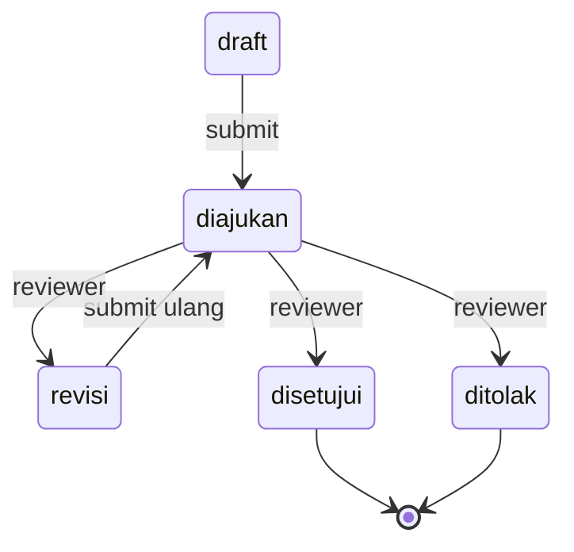

# ARCHITECTURE.md — Permission Matrix & Query Scope (SIM ORMAWA)

Dibuat di Sprint 0. Acuan implementasi `can()` di Sprint 1 (`src/lib/auth/permissions.ts`) dan pola scope filtering di semua query (SCHEMA.md §5).

---

## 1. Diagram Alur Authorization (3 Lapis)

```mermaid
flowchart TD
    REQ[Request masuk] --> MW[1. Middleware\nroute protection\nby role]
    MW -->|boleh akses route| SA[2. Server Action / API Route\ncan&#40;session, action, resource, ownerId&#41;\npermission matrix]
    MW -->|tidak boleh| REDIRECT[Redirect ke dashboard role-nya]
    SA -->|allowed| QS[3. Query Scope\nlib/db/queries/ ...\nscope filtering ormawaId]
    SA -->|denied| DENY[403 / error jelas]
    QS --> DB[(Supabase Postgres via Drizzle)]
```

| Lapis | Lokasi | Tanggung jawab |
|---|---|---|
| 1. Middleware | `src/middleware.ts` | Proteksi route `/dashboard/*`, redirect sesuai role (PRD §4.1) |
| 2. Permission matrix | `src/lib/auth/permissions.ts` → `can()` | Keputusan authz per action×resource×ownerId — **wajib dipanggil di awal setiap server action / API route** |
| 3. Query scope | `src/lib/db/queries/*` | Filter data di level query (`ormawaId` scope). **Tidak boleh ada `db.select()` di luar folder ini** |

Aturan PRD §7: authorization tidak pernah hanya di UI; ketiga lapis selalu jalan.

---

## 2. Permission Matrix `can(session, action, resource, resourceOwnerId?)`

Legenda: ✅ boleh · ❌ tolak · 🚧 tergantung kondisi (dijelaskan di footnote)

### Identitas & Struktur

| Role \ Resource | ormawa | divisi | pengurus | program_unggulan |
|---|---|---|---|---|
| `super_admin` | ✅ semua | ✅ semua | ✅ semua | ✅ semua |
| `kemahasiswaan` | ❌ | ❌ | ❌ | ❌ |
| `lkpka` | ❌ | ❌ | ❌ | ❌ |
| `mpm` | ❌ | ❌ | ❌ | ❌ |
| `bem_koordinator` | 🚧 read all, write only BEM sendiri | 🚧 read all, write BEM sendiri | 🚧 read all, write BEM sendiri | 🚧 read all, write BEM sendiri |
| `admin_ormawa` | 🚧 own ormawaId | 🚧 own ormawaId | 🚧 own ormawaId | 🚧 own ormawaId |

Footnote:
- `admin_ormawa`: semua action (`create`/`read`/`update`/`delete`) hanya jika `resourceOwnerId === session.user.ormawaId`. Tidak pernah lintas-ORMAWA (PRD §3).
- `bem_koordinator` (Keputusan Default #1): `read` = true lintas-ORMAWA; `create`/`update`/`delete` hanya jika `resourceOwnerId === ormawaId` ORMAWA jenis `bem` miliknya sendiri.

### Workflow (program_kerja, proposals, lpj)

| Role \ Resource | program_kerja | proposals | lpj | review_logs |
|---|---|---|---|---|
| `super_admin` | ✅ semua | ✅ semua | ✅ semua | ✅ semua |
| `kemahasiswaan` | ❌ | 🚧 read+review antrian | 🚧 read+review antrian | ✅ read |
| `lkpka` | ❌ | 🚧 read+review antrian | 🚧 read+review antrian | ✅ read |
| `mpm` | ❌ | 🚧 read+review antrian | 🚧 read+review antrian | ✅ read |
| `bem_koordinator` | 🚧 read all, write BEM sendiri | 🚧 read all, write BEM sendiri | 🚧 read all, write BEM sendiri | ✅ read |
| `admin_ormawa` | 🚧 own ormawaId | 🚧 own ormawaId (submit, revisi) | 🚧 own proposal disetujui | ✅ read own |

Footnote:
- Reviewer (`kemahasiswaan`/`lkpka`/`mpm`): antrian **tidak** di-scope by ormawaId — lihat semua (SCHEMA.md §5). Action `review` hanya valid untuk status `diajukan` (state machine, PRD §4.2).
- LPJ hanya bisa dibuat jika `proposal.status === "disetujui"` (Sprint 5).
- Review selalu transaksi: update status + insert `review_logs` dalam satu `db.transaction()` (SCHEMA.md §6).

### Konten Publik

| Role \ Resource | berita | kalender | galeri | arsip | aspirasi |
|---|---|---|---|---|---|
| `super_admin` | ✅ | ✅ | ✅ | ✅ | ✅ read+status |
| semua role lain | ❌ | ❌ | ❌ | ❌ | ❌ (publik: create via form rate-limited) |

- Form publik `/aspirasi` → `create` TANPA session (validasi Zod + rate limiting Upstash, Sprint 6), bukan lewat `can()`.

---

## 3. State Machine Proposal/LPJ (acuan validasi server action)

Transisi lain (misal draft → disetujui langsung) WAJIB ditolak di server action, bukan cuma disabled button UI.

---

## 4. Konvensi Query Scope (Wajib)

1. Semua query di `src/lib/db/queries/`, menerima `session` sebagai argumen pertama.
2. `admin_ormawa` → tambah `where(eq(..., ormawaId))`.
3. Reviewer & `super_admin` → tanpa filter ormawaId.
4. `getXById` → cek ownership setelah fetch; kalau melanggar scope, return `null` (treat as not found, jangan bocorkan keberadaan data).
5. Tidak ada `db.select()` di komponen/route handler — hanya lewat folder ini.

---

## 5. Keputusan yang Diambil di Sprint 0

1. `*Url` → `*Path` di semua kolom file (Keputusan Default #3) — tersimpan storage path; signed URL digenerate on-demand.
2. Index eksplisit di semua kolom `ormawaId` + kolom scope lain (`status`, `proposal_id`, `reviewable`).
3. `review_logs.reviewableType` jadi `pgEnum` (`"proposal" | "lpj"`).
4. `updatedAt` ditambahkan ke `lpj` (dan sudah ada di `proposals`/`ormawa`).
5. NextAuth v5 memakai **JWT session strategy** (Credentials provider) — Drizzle adapter tables (accounts/sessions) tidak dipakai karena tidak ada OAuth; `users` tabel tetap sumber kebenaran user.
6. Private bucket storage: `simormawa-files`, akses hanya via signed URL (expiry ≤5 menit).
7. Project di-pin ke **Next.js 15.5.7** (create-next-app terbaru meng-install 16; PRD mensyaratkan 15).
