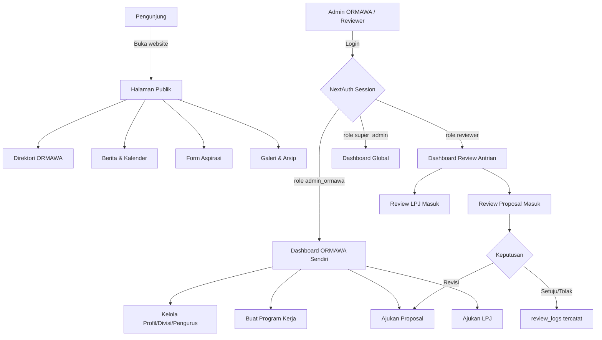
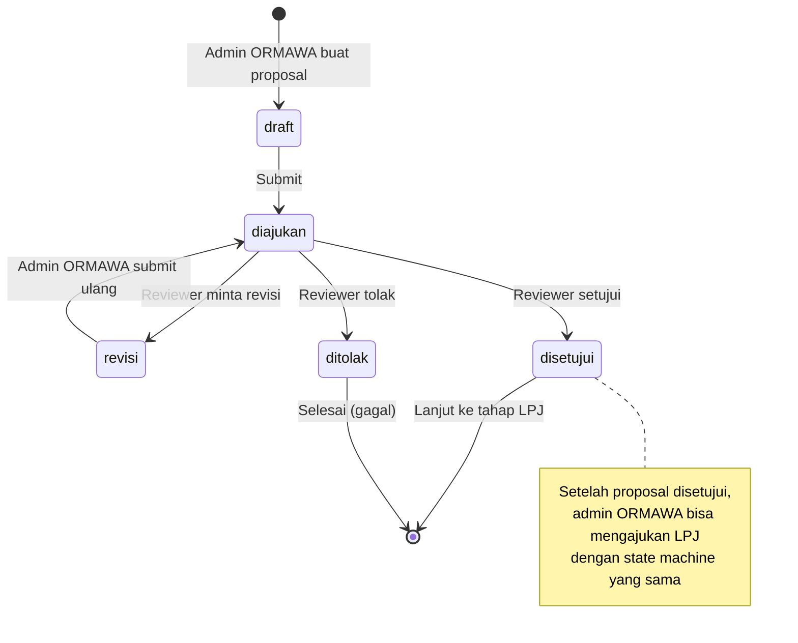
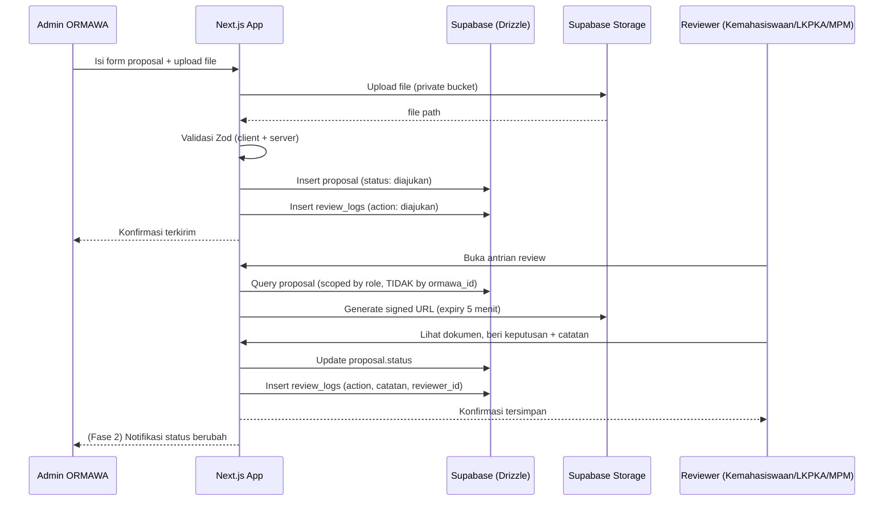
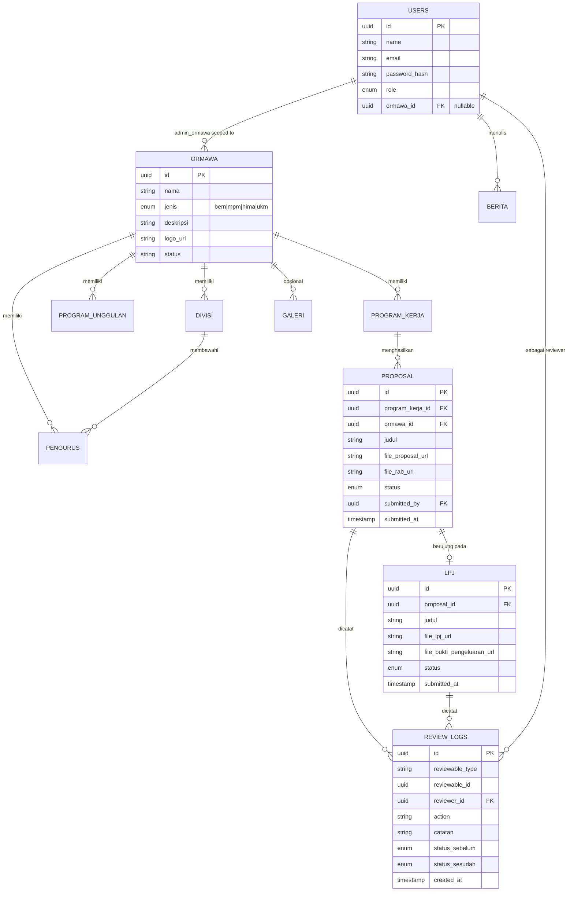

# PRD — SIM ORMAWA KM Universitas Adzkia (Next.js Edition)

Versi: 1.0
Status: Draft disetujui untuk mulai development
Referensi: Rewrite dari `awaaaaja/simormawa` (Laravel + Filament) ke stack Next.js modern

---

## 1. Latar Belakang & Tujuan

SIM ORMAWA adalah sistem informasi untuk mengelola administrasi organisasi mahasiswa (ORMAWA) di KM Universitas Adzkia. Versi ini dibangun ulang dengan stack Next.js untuk konsistensi dengan project lain Yang Mulia (SIREKDOS, NutriCerta, Absensi) dan untuk deployment yang lebih ringan (Vercel + Supabase).

**Tujuan utama:**
1. Menyediakan website publik informasi ORMAWA (transparansi ke mahasiswa umum)
2. Menyediakan dashboard internal untuk workflow administrasi: proposal → RAB → LPJ
3. Role-based access dengan scope per-ORMAWA yang ketat
4. Audit trail penuh untuk setiap keputusan review (accountability)

**Di luar scope MVP:**
- Notifikasi real-time (email/push) — fase 2
- Multi-tenant (selain KM Adzkia) — tidak direncanakan
- Native mobile app — web-only, responsive

---

## 2. Stack Teknologi (Final)

| Layer | Teknologi | Catatan |
|---|---|---|
| Framework | Next.js 15 (App Router, Server Components) | |
| Bahasa | TypeScript (strict mode) | |
| Auth | NextAuth v5 (Auth.js), Credentials Provider | Drizzle adapter |
| Database | PostgreSQL via Supabase | Drizzle sebagai ORM utama, bukan Supabase client untuk query |
| File Storage | Supabase Storage (private bucket + signed URL) | |
| ORM | Drizzle ORM + drizzle-kit (migrations) | |
| Validasi | Zod | Schema dipakai ulang: form client, server action, DB insert type |
| State UI | Zustand | Hanya untuk UI state (sidebar, modal, filter draft) |
| Server State | TanStack Query | Semua data server, cache, mutation, optimistic update |
| Tabel | TanStack Table | List proposal, LPJ, pengurus, dsb. |
| UI Kit | Shadcn UI + Tailwind CSS | |
| PDF Export | `@react-pdf/renderer` | Laporan proposal/LPJ |
| Excel Export | `exceljs` | Rekap data administrasi |
| Deployment | Vercel (production awal), opsi migrasi VPS di fase lanjut | |

---

## 3. Role & Hak Akses

| Role | Scope | Deskripsi |
|---|---|---|
| `super_admin` | Global | Akses penuh seluruh data & pengaturan sistem |
| `kemahasiswaan` | Global (reviewer) | Review proposal & LPJ, monitoring lintas-ORMAWA |
| `lkpka` | Global (reviewer) | Sama seperti kemahasiswaan (jalur review independen) |
| `mpm` | Global (reviewer/pengawas) | Review + pengawasan, tidak mengelola struktur ORMAWA |
| `bem_koordinator` | Institusional, lintas-ORMAWA | Koordinasi antar-ORMAWA, akses baca luas, tidak otomatis kelola struktur ORMAWA lain |
| `admin_ormawa` | Scoped ke `ormawa_id` sendiri | Kelola profil, divisi, pengurus, program kerja, proposal, LPJ milik ORMAWA sendiri (termasuk admin struktur BEM sendiri) |

**Aturan scope**: `admin_ormawa` **tidak pernah** bisa melihat/mengubah data ORMAWA lain. Ini divalidasi di 3 lapis: middleware (routing), permission matrix (server action), dan query-level filtering (lihat `ARCHITECTURE.md`).

---

## 4. Alur Aplikasi (App Flow)

### 4.1 Flow Umum Pengguna

### 4.2 Alur Workflow Proposal & LPJ (State Machine)

### 4.3 Sequence: Pengajuan & Review Proposal

---

## 5. Entity Relationship Diagram

---

## 6. Fitur Rinci

### 6.1 Website Publik
- Beranda: highlight berita, program unggulan, statistik ringkas
- Profil KM: visi-misi, struktur MPM/BEM
- Direktori ORMAWA: filter jenis (HIMA/UKM/BEM/MPM), search
- Detail ORMAWA: profil, divisi, pengurus, program unggulan, galeri
- Berita: list + detail, kategori
- Kalender: kalender kegiatan seluruh ORMAWA
- Aspirasi: form publik (rate-limited), status tampil ke pengirim opsional
- Arsip: dokumen publik (SK, pedoman, dsb.)
- Galeri: foto kegiatan
- Kontak

### 6.2 Dashboard Admin ORMAWA
- Kelola profil ORMAWA sendiri (logo, banner, visi-misi)
- Kelola divisi & pengurus (dengan periode jabatan)
- Kelola program unggulan & program kerja
- Ajukan proposal (dengan file proposal + RAB sebagai 1 dokumen)
- Ajukan LPJ (dengan file LPJ + bukti pengeluaran sebagai 1 dokumen)
- Lihat riwayat review (review_logs) untuk setiap pengajuan
- Revisi & submit ulang proposal/LPJ yang diminta revisi

### 6.3 Dashboard Reviewer (Kemahasiswaan/LKPKA/MPM)
- Antrian proposal & LPJ berstatus `diajukan`
- Detail pengajuan + akses dokumen (signed URL)
- Aksi: setujui / tolak / minta revisi + catatan wajib
- Riwayat review yang pernah dilakukan

### 6.4 Dashboard Super Admin
- Semua fitur di atas untuk semua ORMAWA
- Kelola master data ORMAWA (create/deactivate)
- Kelola user & role
- Kelola konten publik (berita, kalender, galeri, arsip)
- Kelola inbox aspirasi
- Export laporan (Excel/PDF) lintas-ORMAWA

### 6.5 Dashboard BEM Koordinator
- Read access lintas-ORMAWA (monitoring)
- Tidak bisa mengubah struktur ORMAWA lain
- (Fase 2) Fitur koordinasi lintas-ORMAWA (jadwal bersama, dsb.)

---

## 7. Keamanan (Non-negotiable)

1. **Private storage bucket** — tidak ada file yang publicly accessible tanpa signed URL
2. **Signed URL expiry pendek** (≤5 menit), digenerate hanya setelah lolos `can()` check
3. **3 lapis authorization**: middleware → permission matrix → query-level scope (lihat `ARCHITECTURE.md`)
4. **Rate limiting** pada form publik (aspirasi, kontak) — pakai Upstash Redis atau Vercel Edge Config
5. **Validasi file**: whitelist mime-type (pdf, jpg, png), max size (misal 5MB proposal/LPJ)
6. **Password hashing**: bcrypt/argon2 via NextAuth credentials provider
7. **CSRF & security headers**: default Next.js + tambahan `next-safe` atau manual header config
8. **Audit trail**: setiap transisi status wajib tercatat di `review_logs`, tidak boleh update status tanpa log

---

## 8. Non-Functional Requirements

- **Performance**: TTFB halaman publik < 500ms (Vercel Edge/SSG untuk konten publik yang jarang berubah)
- **Aksesibilitas**: Shadcn UI sudah accessible-by-default (Radix primitives), pastikan alt text gambar
- **SEO**: halaman publik pakai metadata dinamis Next.js (`generateMetadata`), sitemap.xml
- **Responsive**: mobile-first, dashboard tetap usable di tablet minimal
- **i18n**: tidak perlu multi-bahasa (Bahasa Indonesia saja)

---

## 9. Dokumen Terkait

- `AGENTS.md` — panduan kerja AI agent (OpenCode) untuk membangun project ini
- `SCHEMA.md` — definisi lengkap skema Drizzle + query patterns
- `SPRINTS.md` — breakdown fase pembangunan
- `PROMPTS.md` — kumpulan prompt siap pakai per fase untuk OpenCode
