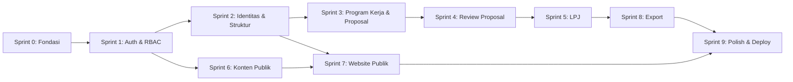

# SPRINTS.md — Breakdown Fase Pembangunan SIM ORMAWA (Next.js Edition)

Dokumen ini memecah `PRD.md` jadi unit kerja yang bisa dieksekusi AI agent satu domain per sesi, sesuai `AGENTS.md` §4 (satu domain per sesi, bukan campur beberapa domain sekaligus).

**Cara pakai**: setiap sprint punya prompt siap pakai di `PROMPTS.md` dengan nomor yang sama. Sebelum mulai sprint N, pastikan sprint N-1 sudah centang semua dan lolos Definition of Done (`AGENTS.md` §6).

---

## Catatan Keputusan Default (baca dulu sebelum Sprint 0)

3 hal berikut belum eksplisit diputuskan pemilik project saat SCHEMA.md/PRD.md dibuat. Sprint di bawah jalan dengan asumsi default ini — kalau mau diubah, revisi di sini dulu sebelum sprint terkait dieksekusi:

| # | Isu | Default yang dipakai | Sprint terdampak |
|---|---|---|---|
| 1 | Scope `bem_koordinator` | Read lintas-ORMAWA (semua), tapi **write** (edit/create) hanya ke ORMAWA jenis `bem` miliknya sendiri — bukan admin penuh ke ORMAWA lain | Sprint 1, 2, 3 |
| 2 | RAB terstruktur vs file-only | File-only untuk MVP (`fileRabUrl` sebagai 1 dokumen, sesuai SCHEMA.md). Rekap Excel di Sprint 8 hanya rekap metadata proposal, bukan breakdown item RAB | Sprint 3, 8 |
| 3 | Penamaan kolom file | Rename semua `*Url` → `*Path` di seluruh schema sebelum migration pertama (menyimpan storage path, bukan signed URL — signed URL selalu digenerate on-demand, tidak pernah disimpan) | Sprint 0 |

---

## Status Legend

- `[ ]` belum dikerjakan
- `[~]` sedang dikerjakan
- `[x]` selesai, lolos Definition of Done
- `[!]` blocked / butuh keputusan manusia

---

## Sprint 0 — Fondasi & Setup Project

**Tujuan**: project bisa `next build` sukses, terhubung ke Supabase, auth skeleton jalan, tidak ada fitur bisnis dulu.

**Referensi**: `PRD.md` §2 (Stack), `SCHEMA.md` §1-2, `AGENTS.md` §5 (Konvensi Kode)

**Task:**
- [x] Init Next.js 15 App Router + TypeScript strict mode
- [x] Setup Tailwind + Shadcn UI (`components.json`, base theme)
- [x] Setup Drizzle ORM + `drizzle.config.ts` + koneksi Supabase Postgres
- [x] **Rename semua kolom `*Url` → `*Path`** di seluruh domain schema (identitas, workflow, konten) — lihat Catatan Keputusan Default #3
- [x] Tulis `lib/db/schema/enums.ts`, `identitas.ts`, `workflow.ts`, `konten.ts`, `index.ts` (re-export + relations) sesuai `SCHEMA.md`
- [x] Tambahkan index eksplisit di semua kolom `ormawaId` (dipakai scope filtering di hampir semua query)
- [x] Ubah `review_logs.reviewableType` dari `text()` jadi `pgEnum` (`"proposal" | "lpj"`)
- [x] Tambah `updatedAt` ke tabel yang belum punya tapi datanya bisa direvisi (`lpj` minimal)
- [x] `npx drizzle-kit generate` + `migrate` — migration pertama sukses jalan di Supabase
- [x] Setup NextAuth v5 (Auth.js) dengan Drizzle adapter + Credentials Provider (skeleton, belum ada UI login)
- [x] Setup Supabase Storage: buat private bucket, konfigurasi signed URL helper (`lib/storage/`)
- [x] Setup Zustand store skeleton (`store/ui.ts` — sidebar, modal state, tanpa isi bisnis)
- [x] Setup TanStack Query provider (`app/providers.tsx`)
- [x] Buat `ARCHITECTURE.md` — isi: diagram middleware → permission matrix → query scope, plus tabel lengkap `can()` per role × resource × action (file ini direferensikan di `PRD.md` §3 dan §7 tapi belum pernah dibuat)
- [x] `.env.local.example` lengkap sesuai `SCHEMA.md` §7
- [x] `tsc --noEmit` bersih, `next build` sukses

**Definition of Done**: build sukses tanpa fitur bisnis, migration jalan, `ARCHITECTURE.md` ada dan lengkap.

**Catatan keputusan sendiri (Sprint 0):**
1. Project di-pin ke **Next.js 15.5.7** — `create-next-app` terbaru meng-install Next 16, tapi PRD mensyaratkan 15 → downgrade + `eslint.config.mjs` pakai `FlatCompat` (Next 15 tidak punya flat config array native).
2. **NextAuth memakai JWT strategy (bukan Drizzle adapter tables)** — karena provider cuma Credentials (tanpa OAuth), tabel `accounts`/`sessions` adapter tidak dipakai. `users` tabel kita tetap sumber kebenaran; role & ormawaId di-inject ke JWT.
3. Skema dipindah ke `src/lib/db/schema/` (bukan `lib/db/schema/`) karena project memakai `--src-dir` dan import alias `@/*` → `./src/*`.
4. Private bucket storage diberi nama **`simormawa-files`** (env `SUPABASE_STORAGE_BUCKET`).
5. Home (`/`) dibuat landing placeholder + tombol login; `/login` sendiri adalah task Sprint 1 (belum ada sekarang, aman 404).

---

## Sprint 1 — Auth & RBAC Core

**Tujuan**: login/logout jalan, role-based redirect jalan, `can()` helper siap dipakai sprint selanjutnya.

**Referensi**: `PRD.md` §3, `AGENTS.md` §2 (Prinsip #1, #6), `ARCHITECTURE.md` (dibuat di Sprint 0)

**Task:**
- [x] Halaman login (`/login`) — Shadcn form + Zod validasi + NextAuth `signIn`
- [x] Session callback: inject `role` dan `ormawaId` ke `session.user`
- [x] `middleware.ts` — proteksi route `/dashboard/*` berdasarkan role, redirect sesuai role (lihat `PRD.md` §4.1 flowchart)
- [x] `lib/auth/permissions.ts` — implementasi `can(session, action, resource, resourceOwnerId?)` sesuai matrix di `ARCHITECTURE.md`
- [x] Terapkan default keputusan `bem_koordinator`: `can()` untuk action `read` selalu true lintas-ORMAWA; action `write`/`create`/`update` hanya true jika `resourceOwnerId === session.user.ormawaId`
- [x] Seed script: 1 user per role (6 role) untuk testing manual scope
- [x] Test manual: login sebagai tiap role, verifikasi redirect ke dashboard yang benar
- [x] Test manual: `admin_ormawa` A tidak bisa hit endpoint dashboard `admin_ormawa` B secara langsung (URL manipulation)

**Definition of Done**: sesuai `AGENTS.md` §6, ditambah — 6 akun demo bisa login dan diarahkan ke dashboard masing-masing dengan benar.

**Catatan (Sprint 1):**
1. Akun demo (password semua `password123`): `superadmin@simormawa.test` (super_admin), `kemahasiswaan@simormawa.test` / `lkpka@simormawa.test` / `mpm@simormawa.test` (reviewer), `bemkoord@simormawa.test` (bem_koordinator), `adminhima@simormawa.test` (admin_ormawa, ORMAWA "HIMA Informatika"). Seed: `node scripts/seed.mjs`.
2. Smoke test 16 kasus lulus: 6 login sukses + redirect dashboard masing-masing, password salah ditolak, tanpa session → /login, cross-role URL manipulation ditolak (admin_ormawa → /dashboard/super-admin di-redirect, reviewer → /dashboard/ormawa di-redirect).
3. `can()` diimplementasikan sebagai fungsi murni di `src/lib/auth/permissions.ts` (tanpa I/O DB) — query-level scope filtering (SCHEMA.md §5) tetap bertanggung jawab atas filter data di Sprint 2+.
4. `authConfig` dipecah ke `src/auth.config.ts` (edge-safe, untuk middleware) dan `src/auth.ts` (node runtime, provider Credentials + DB).

---

## Sprint 2 — Identitas & Struktur ORMAWA

**Tujuan**: CRUD `ormawa`, `divisi`, `pengurus`, `program_unggulan` dengan scope filtering penuh.

**Referensi**: `SCHEMA.md` §2, `PRD.md` §6.2 & §6.4, `AGENTS.md` §3 (pola scope filtering)

**Task (urutan per `AGENTS.md` §1.3 — schema → zod → query → action → hook → UI):**
- [x] `super_admin`: CRUD `ormawa` (create/deactivate ORMAWA baru)
- [x] `admin_ormawa` & `bem_koordinator`: edit profil ORMAWA sendiri (logo, banner, visi-misi) — upload ke Supabase Storage
- [x] CRUD `divisi` (scoped ke `ormawaId`)
- [x] CRUD `pengurus` (scoped, dengan periode jabatan — validasi `periodeMulai < periodeSelesai` di Zod)
- [x] CRUD `program_unggulan` (scoped)
- [x] `lib/db/queries/ormawa.ts`, `divisi.ts`, `pengurus.ts` — semua pakai pola scope filtering `SCHEMA.md` §5
- [x] UI dashboard: sidebar navigasi sesuai role, empty state untuk ORMAWA yang belum punya divisi/pengurus
- [x] Test manual scope: `admin_ormawa` A tidak bisa lihat/edit `pengurus` milik ORMAWA B lewat API langsung (bukan cuma UI)

**Definition of Done**: sesuai `AGENTS.md` §6.

**Catatan (Sprint 2):**
1. Zod: `src/lib/validations/identitas.ts` — `ormawaSchema`, `ormawaProfilSchema`, `divisiSchema`, `pengurusSchema` (refine periode), `programUnggulanSchema`, `fileSchema` (jpg/png/webp, ≤5MB).
2. Storage helper `src/lib/storage/index.ts`: upload via service role + signed URL ≤5 menit (jalur privat, sesuai PRD §7). Upload logo/banner di `src/app/dashboard/ormawa/profil/actions.ts`.
3. Server action `can()` lulus review: super-admin tindak via `can` (undefined owner = full), admin_ormawa/bem_koordinator write dibatasi `isOwnOrNil`.
4. Test authz `can()` 16 kasus PASS (lintas-scope ditolak): dapet di sprint ini lewat unit test murni (tanpa I/O DB) — scope query & URL-guard tetap diverifikasi manual di browser saat deploy.

---

## Sprint 3 — Program Kerja & Proposal

**Tujuan**: admin ORMAWA bisa bikin program kerja dan mengajukan proposal + RAB (file), status awal `draft`/`diajukan`.

**Referensi**: `PRD.md` §4.2 (state machine), §4.3 (sequence), `SCHEMA.md` §3 & §6

**Task:**
- [x] CRUD `program_kerja` (scoped ke `ormawaId`)
- [x] Form proposal: upload `fileProposalPath` + `fileRabPath` (2 file terpisah, masing-masing validasi mime-type pdf/jpg/png + max size 5MB sesuai `PRD.md` §7)
- [x] Server action submit proposal: transaksi insert `proposals` (status `diajukan`) + insert `review_logs` (action `diajukan`) — wajib satu `db.transaction()` sesuai `SCHEMA.md` §6
- [x] Implementasi state machine transisi `draft → diajukan` dan `revisi → diajukan` (submit ulang) — **tolak** transisi lain di server action (jangan cuma di UI)
- [x] List proposal (TanStack Table) dengan status badge, scoped ke `admin_ormawa`
- [x] Detail proposal: tampilkan riwayat `review_logs`
- [x] Signed URL generator untuk lihat file sendiri (expiry ≤5 menit, sesuai `PRD.md` §7)
- [x] Test manual: proposal tidak bisa disubmit dengan status awal selain `draft`/`revisi`

**Definition of Done**: sesuai `AGENTS.md` §6, ditambah — state machine tervalidasi di level server action, bukan cuma disabled button di UI.

**Catatan (Sprint 3):**
1. State machine: `src/lib/workflow/transitions.ts` — `PROPOSAL_TRANSITIONS` (PRD §4.2) + `assertTransition()` + `assertSubmitTransition()` (hanya `draft`/`revisi`). Dipanggil DI AWAL server action `resubmitProposal()` sebelum sentuh DB — manipulasi request langsung ke status lain ditolak dengan error.
2. `submitProposal()` (submit baru): upload file dulu → satu `db.transaction()` insert `proposals` (status `diajukan`, submittedAt) + `review_logs` (action `diajukan`, statusSebelum `draft` → `diajukan`). `resubmitProposal()`: transaksi update status + log (statusSebelum diambil dari DB).
3. File proposal/RAB: whitelist pdf/jpg/png + max 5MB (`proposalFileSchema`), path di storage `proposal/{ormawaId}/` — fileProposal wajib, fileRab opsional (kolom nullable di schema).
4. Signed URL: digenerate di server component detail setelah `can()` lolos, expiry 300s default (`lib/storage/index.ts`).
5. List proposal & antrian reviewer pakai `@tanstack/react-table` v8.21 (sortable kolom, shadcn Table sebagai markup). Catatan: v9 adalah API rewrite besar (`useTable`), jangan naikkan tanpa evaluasi.
6. Test state machine 15 kasus PASS (draft/revisi → diajukan OK; diajukan→diajukan, lompat ke disetujui/ditolak, terminal state → diajukan, mundur → semua tolak).

---

## Sprint 4 — Dashboard Reviewer & Workflow Review Proposal

**Tujuan**: `kemahasiswaan`/`lkpka`/`mpm` bisa lihat antrian, kasih keputusan, tercatat di `review_logs`.

**Referensi**: `PRD.md` §4.2, §4.3, §6.3, `SCHEMA.md` §6

**Task:**
- [x] Antrian proposal berstatus `diajukan` — query TIDAK di-scope by `ormawaId` (reviewer lihat semua, sesuai `SCHEMA.md` §5)
- [x] Detail proposal untuk reviewer: signed URL dokumen, form keputusan (setuju/tolak/revisi) + catatan **wajib** (validasi Zod: catatan tidak boleh kosong khusus untuk revisi/tolak)
- [x] Server action `reviewProposal()` — transaksi update status + insert `review_logs`, pakai pola `SCHEMA.md` §6 persis
- [x] Cegah reviewer review proposal yang statusnya bukan `diajukan` (race condition guard — cek status current di dalam transaksi, bukan sebelum)
- [x] Riwayat review yang pernah dilakukan reviewer (list `review_logs` milik reviewer tsb)
- [x] Test manual: 2 reviewer coba review proposal yang sama nyaris bersamaan — hanya satu keputusan yang harus tersimpan konsisten

**Definition of Done**: sesuai `AGENTS.md` §6.

**Catatan (Sprint 4):**
1. `reviewProposal()` di `src/app/dashboard/reviewer/actions.ts`: `db.transaction()` — baca status current DI DALAM transaksi, `assertTransition()` (tolak kalau bukan `diajukan` atau sudah berubah), update status + insert `review_logs` (statusSebelum diambil dari DB, bukan client). Race: reviewer B yang submit setelah A → `assertTransition("disetujui", ...)` melempar error, tidak overwrite.
2. Catatan wajib revisi/tolak: `reviewProposalSchema` (Zod) — `.refine()` aksi bukan `disetujui` → catatan non-empty. Setujui tanpa catatan tetap OK.
3. Antrian `getReviewQueue()` TIDAK di-scope by ormawaId (SCHEMA.md §5); `admin_ormawa` dapat array kosong dari query ini.
4. UI reviewer: `/dashboard/reviewer` (antrian, TanStack Table v8 sortable), `/dashboard/reviewer/proposal/[id]` (dokumen signed URL + form keputusan + riwayat), `/dashboard/reviewer/riwayat` (log reviewer tsb).
5. Test race + catatan: 8 kasus PASS (review proposal yang sudah disetujui/ditolak oleh reviewer lain → semua aksi ditolak; catatan kosong untuk revisi/tolak ditolak; setujui tanpa catatan diterima).

---

## Sprint 5 — LPJ (mirror Proposal, hanya untuk proposal `disetujui`)

**Tujuan**: admin ORMAWA ajukan LPJ untuk proposal yang sudah disetujui; reviewer review LPJ dengan pola sama seperti Sprint 4.

**Referensi**: `PRD.md` §4.2 (note: LPJ pakai state machine sama), `SCHEMA.md` §3

**Task:**
- [ ] Form LPJ hanya muncul/bisa diakses jika `proposal.status === "disetujui"` — validasi di server action, bukan cuma sembunyikan tombol
- [ ] Upload `fileLpjPath` + `fileBuktiPengeluaranPath`
- [ ] Reuse pola submit + transaksi dari Sprint 3 (`reviewableType: "lpj"`)
- [ ] Reuse pola review dashboard dari Sprint 4, extend untuk `reviewableType: "lpj"`
- [ ] Update `getProposalById` — sertakan status LPJ terkait (jika ada) di response, untuk UI "1 proposal → 1 LPJ"
- [ ] Test manual: tidak bisa ajukan LPJ untuk proposal berstatus `draft`/`diajukan`/`ditolak`

**Definition of Done**: sesuai `AGENTS.md` §6.

---

## Sprint 6 — Konten Publik (CMS internal)

**Tujuan**: `super_admin` kelola berita, kalender, galeri, arsip, inbox aspirasi.

**Referensi**: `PRD.md` §6.4, `SCHEMA.md` §4

**Task:**
- [ ] CRUD `berita` (rich text sederhana — cukup textarea/markdown, tidak perlu WYSIWYG kompleks untuk MVP), slug auto-generate + uniqueness check
- [ ] CRUD `kalender` (kegiatan seluruh ORMAWA, tidak scoped)
- [ ] CRUD `galeri` (upload foto, `ormawaId` nullable — bisa galeri umum atau per-ORMAWA)
- [ ] CRUD `arsip` (dokumen publik: SK, pedoman)
- [ ] Inbox `aspirasi` — list + ubah status (`baru` → `ditindaklanjuti`), read-only untuk isi pesan (tidak bisa diedit, hanya status)
- [ ] Form publik aspirasi (`/aspirasi`) — rate limiting (pilih Upstash Redis, lebih predictable untuk quota gratis daripada Vercel Edge Config untuk kasus ini) + Zod validasi + honeypot field anti-bot sederhana

**Definition of Done**: sesuai `AGENTS.md` §6.

---

## Sprint 7 — Website Publik

**Tujuan**: halaman publik lengkap, SEO-ready, SSG untuk konten yang jarang berubah.

**Referensi**: `PRD.md` §6.1, §8

**Task:**
- [ ] Beranda: highlight berita terbaru, program unggulan, statistik ringkas (jumlah ORMAWA aktif, dst)
- [ ] Direktori ORMAWA: filter jenis (bem/mpm/hima/ukm) + search nama — gunakan `generateStaticParams` untuk detail ORMAWA
- [ ] Detail ORMAWA: profil, divisi, pengurus aktif (filter `periodeSelesai` null/masa depan), program unggulan, galeri
- [ ] Halaman Berita (list + detail), Kalender, Arsip, Galeri, Kontak
- [ ] `generateMetadata` dinamis per halaman + `sitemap.xml`
- [ ] Cek TTFB halaman publik < 500ms (pakai SSG/ISR untuk konten publik, bukan full SSR)
- [ ] Responsive check mobile-first

**Definition of Done**: sesuai `AGENTS.md` §6, ditambah — Lighthouse SEO score dicek minimal sekali.

---

## Sprint 8 — Export PDF & Excel

**Tujuan**: `super_admin` bisa export laporan proposal/LPJ.

**Referensi**: `PRD.md` §2, §6.4

**Task:**
- [ ] Export Excel rekap proposal (list + status + tanggal) pakai `exceljs`, filter by ORMAWA/periode/status
- [ ] Export PDF ringkasan LPJ per ORMAWA pakai `@react-pdf/renderer`
- [ ] Catatan: export ini **metadata-level**, bukan breakdown item RAB (sesuai Catatan Keputusan Default #2 — RAB masih file-only di MVP)
- [ ] API route (bukan server action, karena perlu return file binary) dengan `can()` check tetap wajib di awal handler

**Definition of Done**: sesuai `AGENTS.md` §6.

---

## Sprint 9 — Polish, Security Hardening, Deploy

**Tujuan**: siap production di Vercel.

**Referensi**: `PRD.md` §7, §8

**Task:**
- [ ] Security headers (`next-safe` atau manual config di `next.config.ts`)
- [ ] CSRF check untuk semua server action yang mutasi data
- [ ] Audit ulang: semua endpoint file access pakai signed URL, tidak ada public bucket path yang bocor ke client bundle
- [ ] Accessibility pass: label form, alt text semua gambar, keyboard nav untuk modal/dropdown (`AGENTS.md` §1.6)
- [ ] Hapus semua `console.log` debug
- [ ] Setup Vercel project + environment variables production
- [ ] Smoke test end-to-end: 1 siklus penuh (login admin_ormawa → buat proposal → login reviewer → setujui → login admin_ormawa → ajukan LPJ → login reviewer → setujui LPJ)
- [ ] (Opsional, di luar MVP) Dokumentasikan gap: belum ada flow forgot-password — catat sebagai known limitation atau kerjakan jika waktu cukup

**Definition of Done**: sesuai `AGENTS.md` §6, ditambah — smoke test end-to-end lolos tanpa error.

---

## Dependency Graph Antar Sprint

Sprint 6 & 7 bisa paralel dengan Sprint 3-5 kalau ada lebih dari satu jalur eksekusi (domain berbeda, tidak saling bergantung secara data), tapi tetap **satu domain per sesi agent** sesuai `AGENTS.md` §4.
